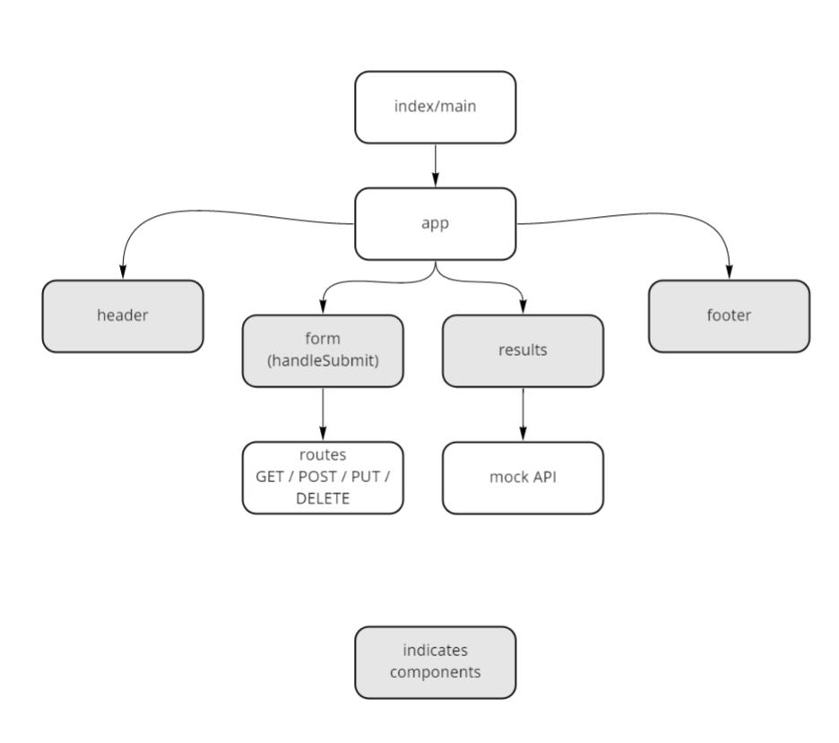

# RESTy

Author: Katy Roffe

Deployment:

## Phase 1

## Problem Domain

Today, we begin the first of a 4-Phase build of the RESTy application, written in React. In this first phase, our goal is to setup the basic scaffolding of the application, with intent being to add more functionality to the system as we go. This initial build sets up the file structure so that we can progressively build this application in a scalable manner

## Requirements

1. Convert all child components of App.js from classes to functions
2. Use .scss files to style each component
3. Core application functionality should remain unchanged between starter code and refactored code

## UML

